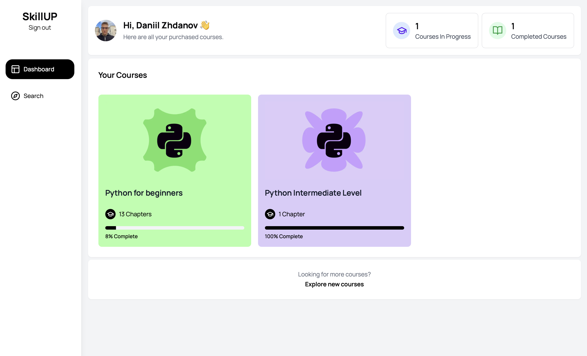

 
<a id="readme-top"></a>
 
<!-- PROJECT LOGO -->
<br />
<div align="center">
  <a href="https://github.com/othneildrew/Best-README-Template">
    
  </a>

  <h3 align="center">SkillUp</h3>

  <p align="center">
    Online educational plateform
    <br />
</div>


 
<!-- ABOUT THE PROJECT -->
## About The Project

**SkillUp** is an online education platform focused on programming courses. The platform offers various tasks categorized by difficulty levels, from beginner to advanced, where tasks are checked automatically using artificial intelligence. 

The platform is designed to provide a seamless learning experience with an integrated IDE and a grading system powered by AI. It aims to help users learn coding through hands-on practice and feedback.



 


### Built With

This section should list any major frameworks/libraries used to bootstrap your project. Leave any add-ons/plugins for the acknowledgements section. Here are a few examples.

* [![Next.js][Next.js]][Next-url]
* [![React][React.js]][React-url]
* [![Tailwind CSS][Tailwind]] 
* [![Docker][Docker]] 
* [![MySQL][MySQL]] 

<p align="right">(<a href="#readme-top">back to top</a>)</p>

[Tailwind]: https://img.shields.io/badge/Tailwind%20CSS-38B2AC?style=flat-square&logo=tailwindcss&logoColor=white

[Docker]: https://img.shields.io/badge/Docker-2496ED?style=flat-square&logo=docker&logoColor=white

[MySQL]: https://img.shields.io/badge/MySQL-00758F?style=flat-square&logo=mysql&logoColor=white
[Python]: https://img.shields.io/badge/Python-3776AB?style=flat-square&logo=python&logoColor=white

<!-- GETTING STARTED -->
<!-- GETTING STARTED -->
## Getting Started

To get a local copy up and running, follow these simple steps.

### Prerequisites

To run the project locally, make sure you have the following installed:

* Node.js
* npm
* Docker (for running the server components)
* MySQL or any other SQL database (if you wish to run the database locally)

### Installation

Follow the steps below to set up the project:

1. Clone the repo
   ```sh
   git clone https://github.com/yourusername/skillup.git
   ```

2. Install NPM packages
   ```
   npm install 
   ```
3. Run scripts 
   ```
   npm run dev 
   ```


<!-- ROADMAP -->
 


<!-- MARKDOWN LINKS & IMAGES -->
<!-- https://www.markdownguide.org/basic-syntax/#reference-style-links -->
[contributors-shield]: https://img.shields.io/github/contributors/othneildrew/Best-README-Template.svg?style=for-the-badge
[contributors-url]: https://github.com/othneildrew/Best-README-Template/graphs/contributors
[forks-shield]: https://img.shields.io/github/forks/othneildrew/Best-README-Template.svg?style=for-the-badge
[forks-url]: https://github.com/othneildrew/Best-README-Template/network/members
[stars-shield]: https://img.shields.io/github/stars/othneildrew/Best-README-Template.svg?style=for-the-badge
[stars-url]: https://github.com/othneildrew/Best-README-Template/stargazers
[issues-shield]: https://img.shields.io/github/issues/othneildrew/Best-README-Template.svg?style=for-the-badge
[issues-url]: https://github.com/othneildrew/Best-README-Template/issues
[license-shield]: https://img.shields.io/github/license/othneildrew/Best-README-Template.svg?style=for-the-badge
[license-url]: https://github.com/othneildrew/Best-README-Template/blob/master/LICENSE.txt
[linkedin-shield]: https://img.shields.io/badge/-LinkedIn-black.svg?style=for-the-badge&logo=linkedin&colorB=555
[linkedin-url]: https://linkedin.com/in/othneildrew
[product-screenshot]: images/screenshot.png
[Next.js]: https://img.shields.io/badge/next.js-000000?style=for-the-badge&logo=nextdotjs&logoColor=white
[Next-url]: https://nextjs.org/
[React.js]: https://img.shields.io/badge/React-20232A?style=for-the-badge&logo=react&logoColor=61DAFB
[React-url]: https://reactjs.org/
[Vue.js]: https://img.shields.io/badge/Vue.js-35495E?style=for-the-badge&logo=vuedotjs&logoColor=4FC08D
[Vue-url]: https://vuejs.org/
[Angular.io]: https://img.shields.io/badge/Angular-DD0031?style=for-the-badge&logo=angular&logoColor=white
[Angular-url]: https://angular.io/
[Svelte.dev]: https://img.shields.io/badge/Svelte-4A4A55?style=for-the-badge&logo=svelte&logoColor=FF3E00
[Svelte-url]: https://svelte.dev/
[Laravel.com]: https://img.shields.io/badge/Laravel-FF2D20?style=for-the-badge&logo=laravel&logoColor=white
[Laravel-url]: https://laravel.com
[Bootstrap.com]: https://img.shields.io/badge/Bootstrap-563D7C?style=for-the-badge&logo=bootstrap&logoColor=white
[Bootstrap-url]: https://getbootstrap.com
[JQuery.com]: https://img.shields.io/badge/jQuery-0769AD?style=for-the-badge&logo=jquery&logoColor=white
[JQuery-url]: https://jquery.com 
